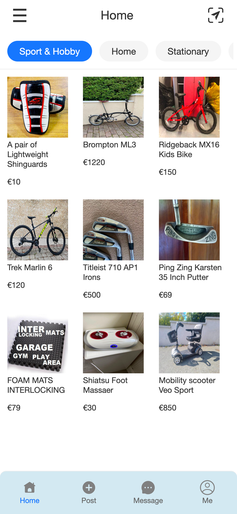
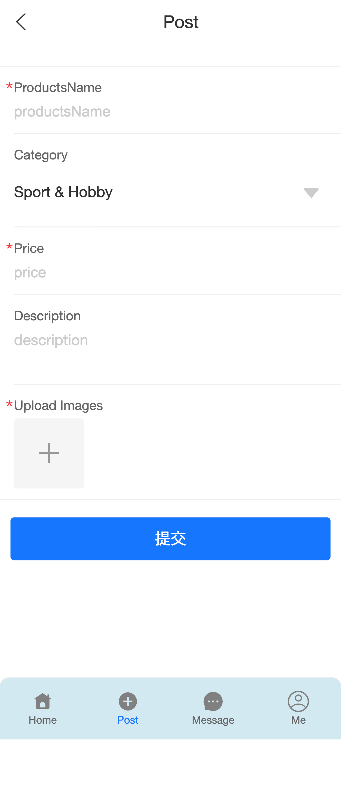
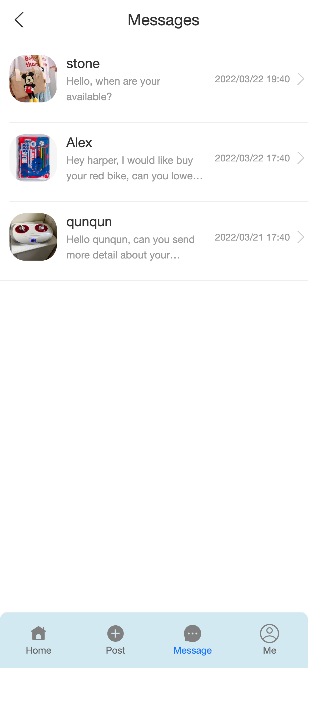
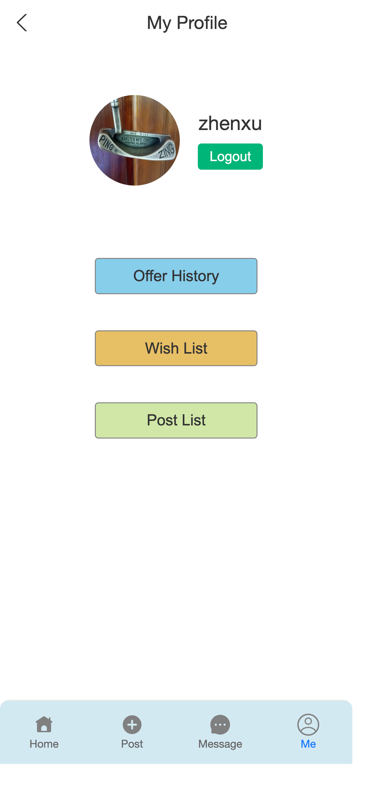
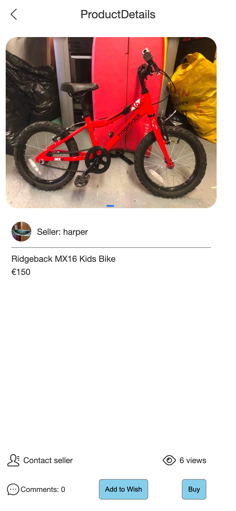
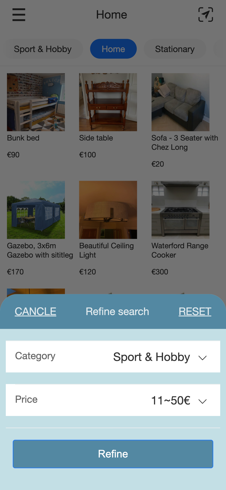

# Second-hand e-commerce App


## 1. Introduction

The  `Second-Hand E-Commerce App`  project is a mobile web application based on React. 

It is designed with modular, component-based, and engineering principles.

The project mainly meet the user's need to buy or sell the second hand with low price.


## 2. Technology Stack

`react 18`                                  :   JSX + hook

`react-router v6`                   :  Router

 `antd-mobile `  						 :  UI components

 `antd-mobile-icons`              :  Icons

`create-react-app`                 :  Scaffold

`axios`  									   :  Call APIs

`localStorage` 					     :  Storage

`react-virtualized`               :  Long list for message

## 3. Functionals

The main functional modules of the `Second-Hand E-Commerce App`  are as follows:

1. **Search for Product:**
   - Filter product options based on price and categories.
2. **Message:**
   - Support the functionality for users communication.
3. **Login Module:**
   - Provide functionality for user registration and login.
4. **Product Details:**
   - Display comprehensive information about product.
5. **History Records:**
   - Offer a module that allows users to view their `offers`   &  `Wish list`   &   `Post list`  history.


## 4. Screenshots Page

####  4.1 Home Page




#### 4.2 Post Page



#### 4.3 Message Page



#### 4.4 Profile Page



#### 4.5 Product Details Page




#### 4.5 Home search Page




## 5. How to run

#### 5.1 Firstly,  run the server 

Note that:  you have to modify the variable of  HOST with your remote server address of IP

the `img_server` is mainly for restoring the pirctures when users post  the pictures related to product.

```shell
cd ./server/img_server
node index.js
```

#### 5.2 Then start the application

```shell
cd /
npm install  #install the denpendencies
npm start    # start the app 
```

#### 5.3 Deploy at remote server 

```shell
npm build #build the application 
cd ./server/deploy_server
node index.js #run the web server 
```


## 6. Others 

If you have any specific questions or need help with anything related to React development or this project, feel free to ask, my email is stoneyezhenxu@gmail.com
